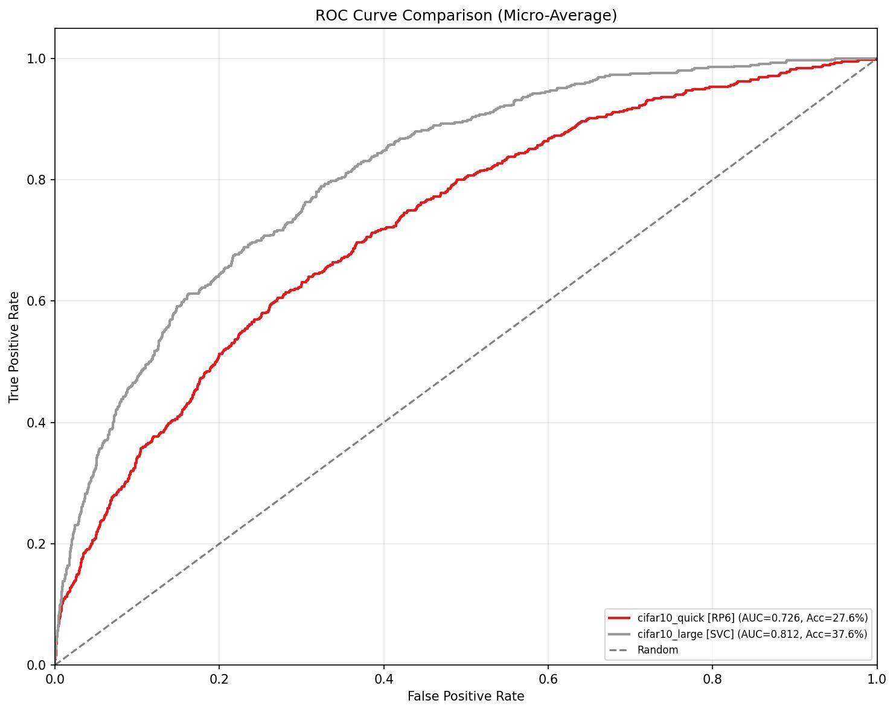
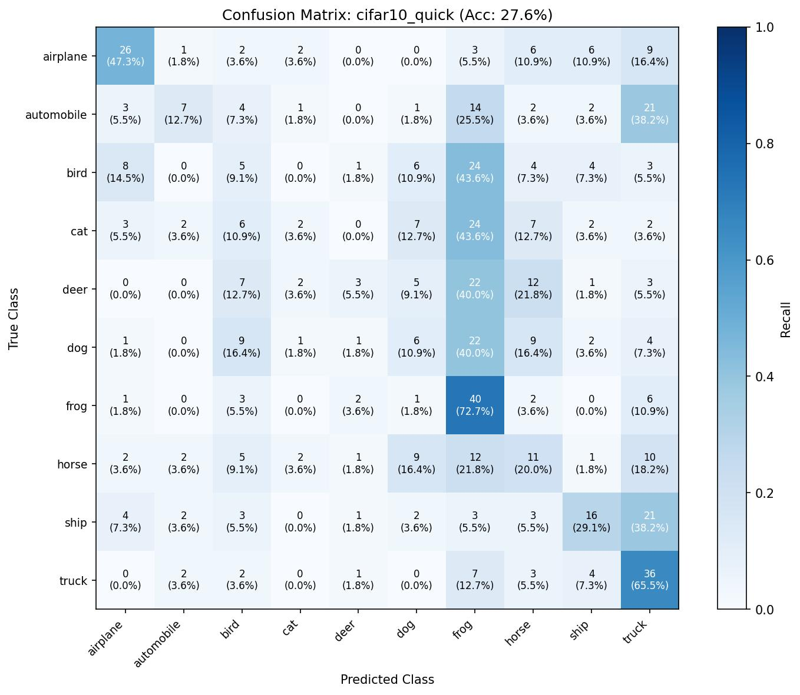
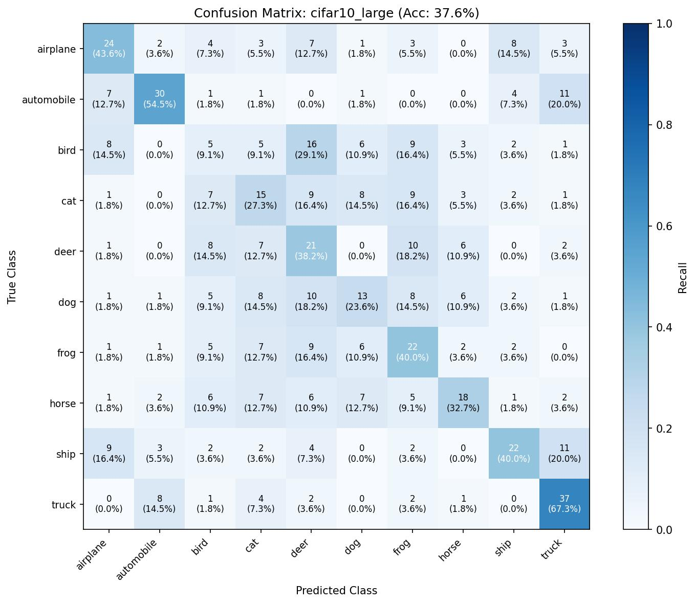

# What the two CIFAR-10 models actually learned — a held-out comparison

**Date:** 2026-05-30
**Author:** Analyst (e2e platform test, multi-persona run)
**Catalog:** `localhost` / catalog **168** (`e2e-test-20260530`)
**Analysis execution (provenance):** [TYR](https://localhost/id/168/TYR) — ROC-analysis notebook run

> **Read this if you are not an ML person.** This report compares two
> image-classifier models the modeling team trained and asks a simple
> question: *which one is better, and in what way?* It avoids jargon
> where it can and explains it where it can't. Every number below can
> be re-derived from a single spreadsheet — see "The data behind this
> report" at the end.

---

## The one-paragraph answer

The team trained two versions of the same image classifier and we scored
both on the **same 550 held-out photos that neither model saw during
training** (the "test set"). The bigger, longer-trained model (**SSE**)
is clearly better overall — it gets **37.6%** of the photos right versus
**27.6%** for the small, quickly-trained model (**RM8**), and it ranks
photos better at *every* sensitivity setting (its ROC curve sits above
RM8's everywhere — see Figure 1). **But the win is not uniform and comes
with a real catch:** SSE improves dramatically on the *hard* categories
the small model essentially gave up on, yet the small model still wins on
a couple of *easy* categories — and SSE is **frequently confident when it
is wrong**, which matters a lot if anyone downstream trusts its
confidence scores. Both models are far from good in absolute terms,
because they were trained on a deliberately tiny dataset (550 training
photos). These are numbers for validating that *the platform and the
comparison work*, not a claim about how well one can classify CIFAR-10.

---

## What was compared, and why these two

Two training runs, both recorded in the catalog, both trained on the
**same 550-photo training set (F2T)** and scored on the **same disjoint
550-photo test set (F34)**:

| Run | Catalog RID | Recipe | Size / effort | Held-out accuracy |
|-----|-------------|--------|---------------|-------------------|
| **RM8** | [RM8](https://localhost/id/168/RM8) | `cifar10_quick_toronto` | small model, **3** passes over the data | **27.6%** |
| **SSE** | [SSE](https://localhost/id/168/SSE) | `cifar10_large_toronto` | larger model, **20** passes over the data | **37.6%** |

"Held-out" is the load-bearing word. F2T (train) and F34 (test) share
**zero** photos — the Curator verified this by direct set intersection
(tacit-knowledge.md tk-001), so the test score is an honest measure of
how the models do on photos they have never seen, not a measure of how
well they memorized the training set. Random guessing on 10 equally-sized
categories would score 10%, so both models have genuinely learned
*something*; SSE has learned more.

> **A trap we deliberately avoided.** The catalog also contains
> "labeled testing" datasets (NEJ, PJ4) whose names and type tags read
> like held-out test sets. They are **not** — they are carved out of the
> *training* pool (tacit-knowledge.md tk-002). Scoring an F2T-trained
> model against them would have *leaked* training photos into the test
> and inflated both accuracies. We scored against **F34** precisely
> because it is the one test partition with no overlap. If you ever
> re-run this, use F34 (`cifar10_testing`).

---

## Figure 1 — The headline picture (ROC comparison)

**How to read it.** Each curve traces a model's trade-off between
catching true positives (vertical axis, higher is better) and raising
false alarms (horizontal axis, lower is better). The dashed diagonal is
random guessing. **A curve that sits higher and further left is a better
model.** SSE (grey) is above RM8 (red) across the *entire* range — there
is no operating point at which the small model is the better ranker. The
single-number summary of "area under the curve" (AUC, where 1.0 is
perfect and 0.5 is random) is **0.81 for SSE vs 0.73 for RM8**. SSE wins
this measure decisively and without ambiguity.

---

## Per-category behavior — where the win actually comes from

Overall accuracy hides the interesting part. Here is how often each model
correctly identified each category (out of 55 photos per category — the
test set is perfectly balanced, 55 each):

| Category | RM8 (small) | SSE (large) | Who wins |
|----------|------------:|------------:|----------|
| airplane   | **47%** | 44% | RM8 |
| automobile | 13% | **55%** | **SSE (+42 pts)** |
| bird       | 9%  | 9%  | tie (both poor) |
| cat        | 4%  | **27%** | **SSE (+24 pts)** |
| deer       | 5%  | **38%** | **SSE (+33 pts)** |
| dog        | 11% | **24%** | SSE |
| **frog**   | **73%** | 40% | **RM8 (+33 pts)** |
| horse      | 20% | **33%** | SSE |
| ship       | 29% | **40%** | SSE |
| truck      | 65% | **67%** | ~tie |

Two things jump out:

1. **SSE's advantage is concentrated in the *hard* categories.** The
   small model essentially *gave up* on automobile (13%), cat (4%), and
   deer (5%) — close to or below random. The larger model rescued exactly
   those: automobile 13%→55%, deer 5%→38%, cat 4%→27%. That is where the
   10-point overall gain comes from.

2. **The small model "wins" frog (73% vs 40%) for the wrong reason.**
   This is not skill — it is a side effect of how the small model fails
   (next section). Treat RM8's frog number as an artifact, not a strength.

---

## Why the small model's "frog" score is misleading (Figure 2)

A confusion matrix shows, for every *true* category (rows), where the
model's *guesses* landed (columns). Correct answers sit on the diagonal;
everything off-diagonal is a mistake.

The small model's matrix has a tell-tale pattern: the **"frog" and
"truck" columns are dark all the way down**. When RM8 is unsure, it
doesn't spread its guesses around — it dumps them into "frog" or "truck."
Across all 550 photos it predicted "frog" **171 times** and "truck" **115
times** (together **52%** of all its guesses), while predicting "cat,"
"deer," and "automobile" only ~10 times each. Because it labels almost
anything froggish as "frog," it happens to catch most of the real frogs
(73%) — but that is a broken model getting lucky on one category, not a
frog specialist. This behavior ("mode collapse") is exactly what an
under-trained, low-capacity model does.

The larger model's guesses are far more evenly spread (range 39–84 per
category, against the true 55 each), which is the healthier picture.

---

## SSE's mistakes make sense — but it is overconfident (Figure 3)

SSE's confusion matrix has a visible diagonal (it is right more often)
and — importantly — **its mistakes are the mistakes a person might make**:

- **Animals get confused with other animals:** bird→deer (29% of birds),
  dog→deer (18%), cat→deer/dog/frog. The model has learned a rough
  "furry/feathered animal" cluster and shuffles within it.
- **Vehicles get confused with other vehicles:** ship→truck (20%),
  automobile→truck (20%), ship→airplane (16%). Again, sensible — these
  share boxy, man-made shapes.

This matches domain intuition: a model that confuses *deer with dog* is
behaving far more sensibly than one that confuses *deer with frog*, and
SSE largely does the former. That is a quality signal beyond the headline
accuracy.

**The catch — confidence you should not trust.** Every prediction comes
with a confidence score (how sure the model claims to be). We checked
whether those scores are *honest*:

| | RM8 (small) | SSE (large) |
|---|---:|---:|
| Avg. confidence when **right** | 0.30 | 0.87 |
| Avg. confidence when **wrong** | 0.24 | 0.77 |
| "Confident" predictions (>0.70) that were **wrong** | 1 | **223** |
| "Confident" predictions (>0.70) that were **right** | 5 | 170 |

SSE is loud: it claims ~0.8 confidence almost across the board — and it is
**confidently wrong more often than confidently right** (223 vs 170 of
its high-confidence calls). In plain terms: *when SSE says it is sure, it
is wrong more than half the time.* This is the fingerprint of the
**overfitting** the modeling team already flagged (tacit-knowledge.md
tk-005): trained for 20 passes, SSE memorized the training photos
(reaching 100% training accuracy) and as a side effect learned to be
over-sure on everything, including photos it gets wrong. RM8 is the
opposite — quiet and under-confident (0.3 even when right), which is
harmless-but-useless. **Practical takeaway: use SSE's *ranking* (its ROC
behavior is genuinely better), but do not take its confidence numbers at
face value.**

---

## Do the two models agree?

Of the 550 test photos, the two models pick the **same** label on only
**197 (36%)**. Breaking down who is right:

- **Both right:** 97 photos
- **Both wrong:** 288 photos (52% — a reminder these are weak models)
- **Only SSE right:** 110 photos (SSE's net rescue)
- **Only RM8 right:** 55 photos (almost all "frog" — the artifact above)

SSE doesn't just shift the average; it correctly handles 110 photos RM8
misses, at the cost of 55 (mostly frogs) that only RM8's collapse caught.
Net, SSE is ahead by the 55-photo (10-point) margin we see in the
headline.

---

## Verdict for the team

- **Pick SSE (`cifar10_large_toronto`, [SSE](https://localhost/id/168/SSE)).**
  It wins overall accuracy (37.6% vs 27.6%), wins AUC at every operating
  point (0.81 vs 0.73), rescues the hard categories the small model
  abandoned, and makes human-sensible mistakes.
- **Two caveats travel with that recommendation:** (1) SSE's confidence
  scores are inflated by overfitting — trust its *ordering*, not its
  *certainty*; (2) RM8's standout "frog" score is an artifact of mode
  collapse, not a real strength — do not cherry-pick it.
- **All numbers are pipeline-validation numbers, not a CIFAR-10
  capability claim.** The substrate is tiny on purpose (550 train, 55 per
  category). The point of this exercise was to confirm the platform
  surfaces real differences between runs and real generalization signal —
  it does, cleanly.

---

## The data behind this report

Everything above is computed from **one wide table**, so a domain expert
can open it in any spreadsheet/tool and re-derive any number here without
re-running anything.

- **`figures/2026-05-30-analysis/prediction_wide_table.csv`** — 550 rows
  (one per held-out F34 photo), 26 columns: `Image_RID`, the
  ground-truth label (`True_Class`), and for **each** model a block of
  columns prefixed `cifar10_quick__RP6__…` (RM8) and
  `cifar10_large__SVC__…` (SSE): the predicted class, the confidence, and
  the full 10-way probability vector. Also committed to the catalog as
  asset [V0R](https://localhost/id/168/V0R).
- **`figures/2026-05-30-analysis/roc_metrics.csv`** — the per-class and
  micro/macro AUC scores + accuracy for both runs (catalog asset
  [V14](https://localhost/id/168/V14)).
- **Figures** in `figures/2026-05-30-analysis/` — ROC comparison
  ([V0Y](https://localhost/id/168/V0Y)), per-model ROC curves
  ([V0T](https://localhost/id/168/V0T) / [V0W](https://localhost/id/168/V0W)),
  confusion matrices ([V10](https://localhost/id/168/V10) /
  [V12](https://localhost/id/168/V12)).
- **Executed notebook** (every output, fully reproducible):
  [V28](https://localhost/id/168/V28) (.ipynb) /
  [V2A](https://localhost/id/168/V2A) (.md), produced by analysis
  execution [TYR](https://localhost/id/168/TYR).

### How ground truth was joined (the non-obvious bit)

The `Image_Classification` feature on `Image` is **dual-purpose**: the
data loader wrote the *ground-truth* labels there (execution
[CVC](https://localhost/id/168/CVC), 1100 rows, no confidence score), and
*each training run also wrote its predictions* into the same feature
(RM8 and SSE, 550 rows each, with confidence scores). A naive read of the
feature returns ground truth and every model's predictions interleaved
(2700 rows for these images). To build a correct table we scoped strictly
by producing execution: ground truth = the loader's rows (the ones with
no confidence score), predictions = each run's own rows. Getting this
wrong silently corrupts every accuracy number — see tacit-knowledge.md
tk-006 for the full convention.
